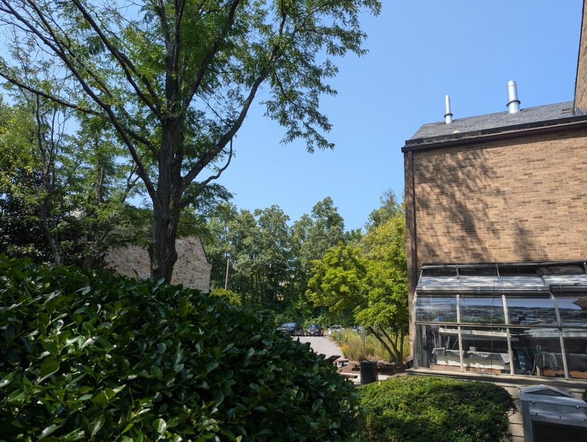
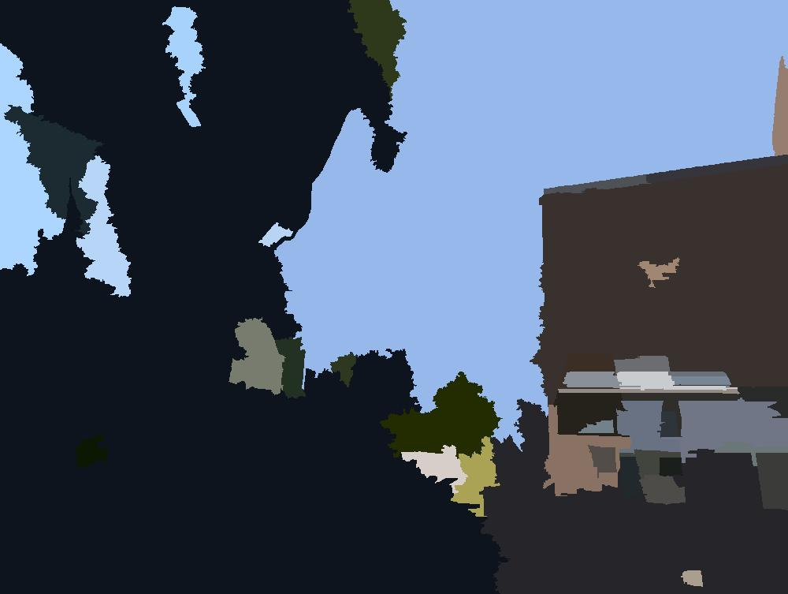

# Image Segmentation

A common image processing task is to break up an image into similar regions by color. This is known
as _image segmentation_. It is a fundamental feature of software like Photoshop and a critical process in computer vision. There are a variety of ways to perform this task, but here we will experiment using the Union-Find algorithm.

## Objective

Suppose we want to segment the image below:

We can break the process up into a few steps:

1. Create a UF data structure with one node per pixel.

2. Loop through the pixels and for each pixel, check the pixels to the right and below it. If the pixels are similar in color (within some threshold), union the two pixels.

3. After all of the pixels have been processed, it is possible that some pixels will not be connected to anything or that some small isolated regions may exist which are really part of a larger region. To fix this, we check the size of each pixel's component. If the component is below a given size, we merge it with the most similar neighboring component by color.

4. Finally, we loop through the pixels and assign them the average color of their component.

The result of this process is shown below:

## Challenges
One unexpectedly difficult part of this task is calculating the average color of a component at the end. Because we will use Weighted Quick Union, there is no nice way to extract the entire component. An efficient solution to this problem is to extend the UF data structure to keep track of the average color of each component. This way, we can easily determine the color of any given pixel by looking up the color of its component.

## Implementation
You have already been given the code for the UF data structure and average color calculation through the course Python package.
You will need to implement the following functions:

1. `segment_image(image, threshold, min_size)`: This function takes an image, a color similarity threshold, and a minimum component size. It returns the image segmented by the given parameters (see steps above).

2. In `ColorAveragedUF` class, override the `union` method to update the average color of the new component.

3. In `ColorAveragedUF` class, implement the `get_average_color` method to return the average color of a component.

You may add additional functions or methods as needed; however, as always, your code will be tested on these three functions. You must ensure they are implemented correctly without an additional need for a test client to independently invoke other functions.

## Advice on Segmenting an Image

Getting a good segmentation is a function of a good algorithm and good parameters. With the right parameters the algorithm should be efficient and effective. However, it is possible to make the algorithm very slow by choosing the wrong parameters. For example, setting the similarity threshold very low will result in many small components that will need to be merged. That's going to take forever. Instead, consider setting the minimum size to zero and tweak the similarity threshold until you get a good segmentation and then increase the minimum size to remove small components.